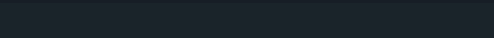

 

## 📌 My Skill Set

<table><tr><td valign="top" >

### Frontend

 
  &nbsp;
 &nbsp;
  &nbsp; &nbsp;
 &nbsp;
  &nbsp;
  
  
 
  &nbsp;
 

</td><td valign="top" >

### Backend

  
 

  

 
  
 &nbsp;
  &nbsp;
   &nbsp;

 

 
 
 
 
</td></tr></table>  

## 📌 Connect with me

  

  

## 📌 Github Stats

 

 

 

 

